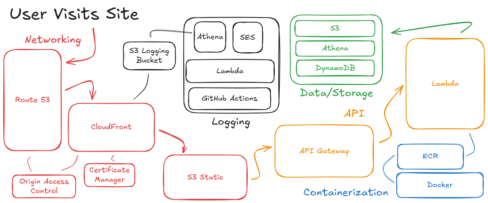

# ChalkJuice

[Use the Model](https://chalkjuice.com)

link to diagram 'https://excalidraw.com/#json=aa60tQfZB0d3HoVcrRHSj,0hysc_ad41UkUoPTq4dhgQ'

# Barry - NFL Game Prediction Model 

Barry uses Machine Learning and a dataset of all previous NFL matchups to predict the amount of times a team will win against the provided opponent. 

When a team wins in an actual NFL matchup, the winning team isnt neccesarily the better team, it was just the better team that day. This model simulates a matchup 100 times, providing a better understaning of which team is better. 

You can compare teams from different years or the same team over different years.

It does so by 1- generating what the team is expected to score - considering the strength of their offense and the strength of the opponent's defense. 2- generate a score around that mean based on how much scores typically vary across real historical matchups. 

NOTE: Barry reserves the first 34 games of a teams existance for model training, so those initial games are not suitbale for use in the model. 

email joelday.business@gmai.com with any questions, issues, or fun ideas!

## Ideas

IDEA: Redesign logo with three circles idea. black and white on the I. Loading screen with logo moving. maybe just an image that pulsates in size. 

IDEA: All time rankings or fake simulated league with ELO ratings

IDEA: Future game schdule table. click to run through model (current stats) and priovde current API odds for the game. Use the match up templatre i created (visual)

IDEA: Add summary pane underneath table with relevant info based on selected team(s)/ year. Add a best team worst team

IDEA: Biggest upsets all time. Win despite lowest win % chance

IDEA: Click the column headers to sort by that column. click again for reverse sort. dont requery - use the table saved in javascript. 

